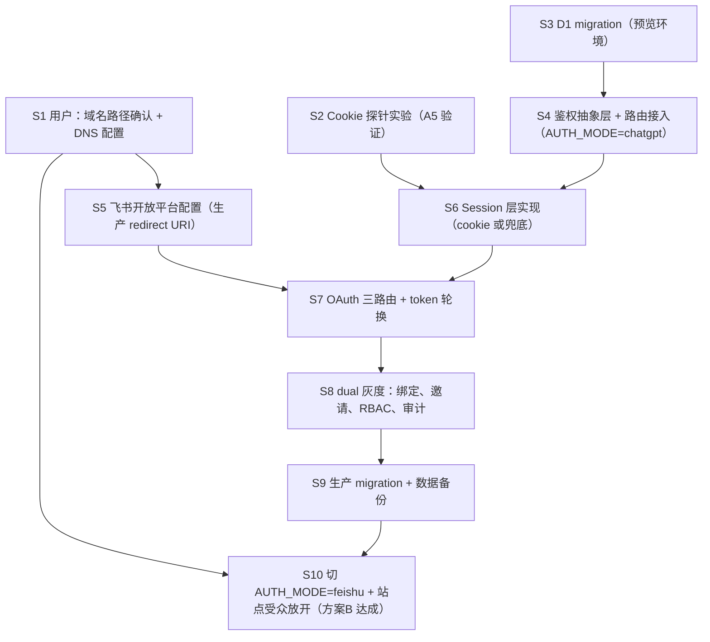

# 方案B 实施方案：飞书作为 Verdent Growth OS 主登录

状态：待执行方案文档（本轮不写业务代码、不执行 migration、不改现有文件）
日期：2026-07-27
前置调研：`/Users/a1234/.verdent/workspace/749813953438416896/796c3ef7-dac2-49ad-bf59-7dd62425e7cd/memories/growth-os-feishu-login-research.md`

---

## 0. 决策背景与总体策略

用户已拍板 **方案B：飞书作为主登录**。目标：新同事只要有 Verdent 企业飞书账号即可打开站点，不再依赖 ChatGPT 工作区权限。

调研报告曾推荐方案C（ChatGPT 门禁 + 飞书内层绑定）作为首发，原因是方案B 依赖三个**未验证**的平台能力。本方案不推翻用户决策，而是把方案B 拆成「灰度通道」：

- **先以方案C 的形态上线全部飞书基础设施**（OAuth、session、用户表、RBAC），此阶段站点仍是 private，风险为零；
- **所有未验证能力逐项验证通过后**，把站点受众切为 `anyone on the internet`，飞书 session 成为唯一鉴权来源，即达成方案B 终态；
- 期间任何一环失败，可通过一个环境变量瞬间切回 ChatGPT 鉴权（见第 5 节）。

### 0.1 全局假设验证状态表（硬性要求 1）

| # | 假设 | 状态 | 证据 | 失败时降级路径 |
|---|------|------|------|----------------|
| A1 | Sites 支持自定义 API 路由（GET/POST/PUT、读 header、访问 D1） | **已验证** | 生产运行中的 `app/api/workspace/route.ts`、`app/api/integrations/route.ts` | 不适用 |
| A2 | Sites 支持自定义域名（apex 或 subdomain，需自配 DNS） | **已验证**（官方文档；但 Enterprise workspace 在 launch 阶段不支持——当前 workspace 类型未确认，见 A3） | 调研报告 §2.1.4 | 路径2（§1.3） |
| A3 | 当前 ChatGPT workspace 类型允许绑定自定义域名 | **未验证**（`moirahou1.chatgpt.site` 疑似个人/团队 workspace，但未在后台确认） | 无 | 路径2（§1.3） |
| A4 | 用户拥有 `verdent.ai` 的 DNS 控制权 | **未验证**（用户尚未确认） | 无 | 路径2（§1.3） |
| A5 | Sites 上自定义路由可写 `Set-Cookie` 且浏览器稳定回传（含 HttpOnly/Secure/SameSite） | **未验证**（代码库无先例，官方文档无承诺） | 调研报告 §2.2.2、§3.2 | D1 session + 前端持有 session id（§3.3） |
| A6 | 自定义 OAuth callback 路由可作为生产级第三方 redirect URI 长期使用 | **未验证**（技术上高度可行，平台未正式承诺） | 调研报告 §3.1 | 保留 ChatGPT 门禁（回退方案C 形态）或独立后端拆分（§1.3 B 方案） |
| A7 | 默认 `*.chatgpt.site` URL 跨部署长期稳定 | **未验证** | 调研报告 §2.2.3 | 只用自定义域名注册 redirect URI；开发期临时注册当前 URL 并接受可能失效 |
| A8 | 飞书授权码流程、code 5 分钟单次有效、refresh_token 一次性轮换、可用范围限制企业成员（错误码 20010） | **已验证**（飞书官方文档） | 调研报告 §4 | 不适用 |
| A9 | 飞书 redirect URI 须预注册、最多 300 个 | **已验证** | 调研报告 §4.3 | 不适用 |
| A10 | 飞书生产 redirect URI 是否强制 HTTPS / 支持通配子域 | **未验证** | 调研报告 §4.3 | 全部按 HTTPS + 精确 URI 注册（最保守假设，无额外成本） |
| A11 | Sites 站点受众可切换为 `anyone on the internet` | **已验证**（官方文档列出该选项） | 调研报告 §2.1.1 | 不适用 |
| A12 | Sites 环境可配置自定义环境变量 / secrets | **已验证**（现有 `.env.example` 全部 secrets 走 hosted Sites 环境；`app/api/integrations/route.ts` 通过 `env` 读取） | 源码 `secret()` 函数 | 不适用 |

**排期原则：凡引用未验证假设的步骤，都在其前置放一个验证步骤，验证不通过即走降级路径，不影响其余并行工作。**

---

## 1. 域名方案（关键路径）

飞书 OAuth 要求 redirect URI 预注册且稳定（A8/A9 已验证）。默认 `chatgpt.site` 域名稳定性未验证（A7），因此**生产级方案B 的硬前提是一个我们可控的稳定域名**。

### 1.1 前置验证（两条路径共同的第 0 步）

在 ChatGPT Sites 管理后台确认两件事（用户操作，约 5 分钟）：

1. 当前 workspace 是否显示「Custom domain」配置入口（验证 A3）；
2. 后台给出的 DNS 配置指引（CNAME 目标值或 A/AAAA 记录、TXT 验证记录）——**以下 DNS 记录均以后台实际显示为准**，本文档给出的是典型形态。

### 1.2 路径1：有 verdent.ai DNS 控制权

**目标：`growth.verdent.ai` → ChatGPT Sites。**

用户需要做的操作：

1. 在 ChatGPT Sites 后台该项目（project id `appgprj_6a60765732f08191afa531267f80f062`）的设置中添加自定义域名 `growth.verdent.ai`，后台会给出需要添加的 DNS 记录（约 5 分钟）。
2. 在 verdent.ai 的 DNS 服务商处添加后台要求的记录，典型形态（**未验证**，以后台为准）：
   - `CNAME growth.verdent.ai → <后台给出的目标，通常是 *.chatgpt.site 或平台边缘域名>`
   - 可能还需一条 `TXT` 域名所有权验证记录
   （操作约 10 分钟；DNS 生效通常几分钟到 1 小时，最长 24–48 小时）
3. 回到 Sites 后台点验证/生效，确认 HTTPS 证书签发完成（平台自动，通常几分钟）。
4. 验收：浏览器访问 `https://growth.verdent.ai` 能打开站点（此时仍 private，需 ChatGPT 登录，属正常）。

**用户总耗时：约 20 分钟操作 + DNS 等待。**

拿到域名后，飞书 redirect URI 固定注册为：
`https://growth.verdent.ai/api/auth/feishu/callback`

### 1.3 路径2：无 verdent.ai DNS 控制权

按代价从低到高给三个备选，任选其一：

**2-A（推荐）：另注册一个团队可控域名**
- 例如 `verdentgrowth.com` / `verdent.tools`，注册商任选（约 10 美元/年）。
- 后续步骤与路径1 完全相同，只是域名不同（如 `growth.verdentgrowth.com`）。
- 用户操作：注册域名（10 分钟）+ 路径1 的第 1–4 步。
- 缺点：域名不是 verdent.ai 品牌域，仅此而已。功能上零差异。

**2-B：拆分架构 —— OAuth 回调 + session 放独立后端，Sites 只做前端**
- 在自己可控的平台（如 Cloudflare Workers 免费版 + `*.workers.dev` 域名，或任意可控 VPS）部署一个极小的 auth 服务：承接 `/api/auth/feishu/*` 回调、持有 App Secret、管理 session、提供 `GET /me`。
- Sites 前端跨域调用该 auth 服务（CORS + credentials）。
- 优点：完全绕开 A5/A6/A7 三个未验证项——auth 服务的域名、cookie、回调都在我们完全控制的运行时里。
- 缺点：
  - 引入第二个部署单元和第二套运维（secrets、监控、发布）；
  - 跨域 cookie 需要 `SameSite=None; Secure`，且 Sites 前端 fetch 需 `credentials: "include"`——**第三方 cookie 在部分浏览器（Safari ITP 等）会被拦截，这本身又是一个未验证风险**，很可能被迫落到「前端持有 session id」模式（§3.3）；
  - 业务 API 仍在 Sites 上，D1 数据也在 Sites 侧，auth 服务与业务 API 之间还需一层信任传递（如 auth 服务签发短期 JWT，Sites API 用共享公钥验签）。
- 用户操作：提供一个 Cloudflare 账号（或同意新建），约 15 分钟；其余是开发工作。
- **定位：仅当 2-A 也不可行（例如公司政策禁止新注册域名）时才选。**

**2-C：临时用当前 `*.chatgpt.site` 域名直接注册 redirect URI**
- 飞书支持最多 300 个 redirect URI（A9 已验证），可以把 `https://verdent-growth-os.moirahou1.chatgpt.site/api/auth/feishu/callback` 注册进去先跑通全链路。
- 风险：A7 未验证，URL 若因重建/迁移变化，登录整体失效。
- **定位：仅作为开发/验证期的过渡手段，不作为生产终态。** 无论走路径1 还是 2-A，开发期都建议同时注册这个 URI 以便联调。

### 1.4 路径决策点

| 用户回答 | 走向 |
|---|---|
| 「我有 verdent.ai DNS 权限」且 Sites 后台有自定义域名入口 | 路径1 |
| 「没有 DNS 权限」或短期拿不到 | 路径2-A |
| 2-A 也不行 | 路径2-B |
| 域名事项全部待定，但想先看到登录跑通 | 先用 2-C 联调，不上线切换 |

---

## 2. 飞书 OAuth 全链路

以下流程本身全部基于**已验证**的飞书官方规范（A8）。落在 Sites 上的 callback 路由属于 A6（未验证，需第 8 节步骤 S2 验证）。

### 2.1 飞书开放平台配置（用户操作，详见第 9 节）

- **应用类型**：企业自建应用（当前 `.env.example` 中的 `FEISHU_APP_ID/SECRET` 草稿即此类型，可复用同一应用）。
- **启用能力**：网页应用（开启「网页」能力，配置桌面端/移动端主页 URL 为站点地址）。
- **重定向 URL**（安全设置 → 重定向 URL）：
  - 生产：`https://growth.verdent.ai/api/auth/feishu/callback`（或路径2 域名）
  - 联调：`https://verdent-growth-os.moirahou1.chatgpt.site/api/auth/feishu/callback`
- **权限范围（scopes）**：
  - 基础用户信息（`authen` 基础，无需额外申请即可拿 open_id/union_id/name/avatar）
  - `contact:user.email:readonly` —— 拿企业邮箱用于展示与邀请匹配（注意：邮箱**不做**唯一身份锚点，锚点是 `union_id`，飞书官方明确邮箱不宜作登录凭证）
  - `offline_access` —— 必须申请，否则不返回 refresh_token
- **可用范围**：设为「仅 Verdent 企业内指定范围/全员」。飞书保证：无应用使用权限的用户换 token 报错 `20010`（已验证）。**服务端仍做二次校验**：换到用户信息后检查 `tenant_key` 等于 Verdent 企业的 tenant_key，不匹配直接拒绝建 session。
- 应用需发布（企业内可见）后授权才生效。

### 2.2 授权码流程逐步设计

新增三个路由（均为标准 App Router Route Handler，运行时能力属 A1 已验证）：

```
GET  /api/auth/feishu/login      → 生成 state，302 到飞书授权页
GET  /api/auth/feishu/callback   → 校验 state，code 换 token，拿用户信息，建 session
POST /api/auth/logout            → 吊销本地 session
GET  /api/auth/me                → 返回当前 session 对应用户（前端启动时调用）
```

**Step 1 — 发起授权（`/api/auth/feishu/login`）**

1. 服务端生成 `state = <随机128bit hex>`，写入 D1 `auth_states` 表（含 `created_at`、`return_to`、10 分钟过期）。
   - 之所以 state 落 D1 而非 cookie：不依赖未验证的 cookie 能力（A5），callback 时按 state 值查表即可完成 CSRF 校验，一次性消费后删除。
2. 302 跳转：

```
https://accounts.feishu.cn/open-apis/authen/v1/authorize
  ?client_id={FEISHU_CLIENT_ID}
  &redirect_uri={FEISHU_REDIRECT_URI}   ← 必须与预注册完全一致
  &response_type=code
  &scope=contact:user.email:readonly offline_access
  &state={state}
```

（授权页入口以飞书当前文档为准，调研报告记录的 `passport.feishu.cn/suite/passport/oauth/authorize` 与新版 `accounts.feishu.cn/.../authen/v1/authorize` 并存，实现时以开放平台后台生成的授权链接为准，两者均为已验证的官方入口形态。）

**Step 2 — 回调（`/api/auth/feishu/callback?code=...&state=...`）**

1. 按 `state` 查 `auth_states`：不存在/已过期 → 401 拒绝；存在 → 立即 DELETE（单次消费）。
2. 用 `code` 换 token（code 5 分钟有效、单次使用，已验证）：

```
POST https://open.feishu.cn/open-apis/authen/v2/oauth/token
Content-Type: application/json
{
  "grant_type": "authorization_code",
  "client_id": FEISHU_CLIENT_ID,
  "client_secret": FEISHU_CLIENT_SECRET,
  "code": code,
  "redirect_uri": FEISHU_REDIRECT_URI
}
→ { access_token, expires_in, refresh_token?, refresh_token_expires_in?, scope }
```

3. 拿用户信息：

```
GET https://open.feishu.cn/open-apis/authen/v1/user_info
Authorization: Bearer {access_token}
→ { open_id, union_id, tenant_key, name, avatar_url, email?, enterprise_email? }
```

4. 服务端校验：`tenant_key === env.FEISHU_TENANT_KEY`（Verdent 企业），否则 403。
5. upsert 身份与用户（见 §7.2 身份归并规则），创建本地 session（见第 3 节）。
6. 302 回 `return_to`（沿用 `chatgpt-auth.ts` 中 `safeRelativeReturnPath` 同款白名单校验，防开放重定向）。

**Step 3 — token 存储原则**

- `access_token` / `refresh_token` **只存服务端 D1**（`user_identities` 表加密列或独立 `feishu_tokens` 表，见 §4），永不下发浏览器。
- 应用自身的登录态靠**本地 session**，不靠飞书 access_token 的有效期——飞书 token 只在需要调飞书 API（未来文档摄取等）时使用。因此即使 refresh 失败，用户的应用会话也不受影响，只是飞书 API 能力降级。

### 2.3 refresh_token 一次性轮换的原子更新设计（防并发覆盖）

飞书规则（已验证）：refresh_token 单次有效，刷新成功返回新 refresh_token，旧的立即失效。风险场景：两个并发请求同时用旧 refresh_token 刷新——第二个必然失败，且若第一个的新 token 没落库，链条断裂，用户需重新授权。

设计（利用 D1/SQLite 的单写者特性 + 条件 UPDATE 实现乐观锁）：

```sql
-- feishu_tokens 表（见第4节 DDL）中有 refresh_token、token_version、refresh_lock_until

-- 刷新前：抢锁（原子，UPDATE 在 SQLite 中是原子的）
UPDATE feishu_tokens
SET refresh_lock_until = datetime('now', '+30 seconds')
WHERE user_id = ?
  AND (refresh_lock_until IS NULL OR refresh_lock_until < datetime('now'));
-- meta.changes === 1 → 拿到锁，继续刷新
-- meta.changes === 0 → 有并发刷新在进行：等待 1–2 秒后重读表；
--                      若 access_token 已更新则直接使用，不再自行刷新
```

刷新流程：

1. 抢锁成功者调用飞书 refresh 接口；
2. 成功：一条 UPDATE 同时写入新 `access_token`、新 `refresh_token`、`expires_at`、`token_version = token_version + 1`、`refresh_lock_until = NULL`（单语句原子）；
3. 失败（网络错误但请求可能已到达飞书，旧 token 可能已被消费）：将 `status` 置为 `needs_reauth` 并清锁——用户下次触发飞书 API 能力时引导重新授权，**应用会话不中断**；
4. 锁超时 30 秒自动失效，避免死锁。

补充保护：所有「读 access_token」的代码路径统一收敛到一个 `getFeishuAccessToken(userId)` 函数，内部处理「未过期直接返回 / 过期走上述带锁刷新」，业务代码不允许直接摸 token 列。

---

## 3. Session 存储机制

### 3.1 首选：HttpOnly Cookie（A5 未验证 → 先做 5 分钟验证实验）

**验证实验（一次部署即可完成，5 分钟内出结论）：**

新增一个临时探针路由 `app/api/auth/cookie-probe/route.ts`（约 20 行，验证完删除）：

```ts
// 伪代码，非交付代码
export async function GET(request: Request) {
  const echoed = request.headers.get("cookie")?.includes("verdent_probe=");
  return new Response(JSON.stringify({ echoed }), {
    headers: {
      "content-type": "application/json",
      "set-cookie":
        "verdent_probe=1; Path=/; HttpOnly; Secure; SameSite=Lax; Max-Age=300",
    },
  });
}
```

操作步骤：

1. 部署到 Sites（正常发布流程）；
2. 浏览器直接访问 `https://<站点域名>/api/auth/cookie-probe` 两次；
3. 第一次返回 `{"echoed":false}`，**第二次返回 `{"echoed":true}` → A5 验证通过**；
4. 第二次仍是 `false` → 检查 DevTools Network 面板：
   - 响应里没有 `Set-Cookie` 头 → 平台剥离了响应 cookie，A5 失败；
   - 有 `Set-Cookie` 但后续请求不带 → 浏览器/平台侧拒收，A5 失败；
5. 追加验证：在站点页面 console 里 `document.cookie` 应读不到 `verdent_probe`（确认 HttpOnly 生效）；再从前端 `fetch("/api/auth/cookie-probe")`（同源默认带 cookie）确认 XHR 路径也回传。

**通过后的正式设计：**

- Cookie：`verdent_session=<高熵随机256bit>; Path=/; HttpOnly; Secure; SameSite=Lax; Max-Age=1209600`（14 天）
- D1 `sessions` 表只存 token 的 SHA-256 哈希（`session_token_hash`），拖库不泄露可用凭证；
- 登录成功时轮换（重新签发）session token；登出置 `revoked_at`；
- `SameSite=Lax` 足以覆盖 OAuth 302 回跳场景（top-level GET 导航会带 Lax cookie），同时挡掉跨站 POST 型 CSRF；写操作路由再校验 `Origin`/`Sec-Fetch-Site` 头作为纵深防御。

### 3.2 兜底：D1 session + 前端持有 session id

触发条件：3.1 实验失败。

设计：

1. callback 成功后不再 `Set-Cookie`，改为 302 到 `/#auth_token=<一次性交换码>`（交换码 60 秒有效、单次使用，存 `auth_states` 同表复用）；
   - 用 URL fragment 而非 query：fragment 不进服务器日志、不进 Referer；
2. 前端启动脚本读取 fragment、立即 `history.replaceState` 清掉、调 `POST /api/auth/exchange` 用交换码换正式 `session_id`；
3. `session_id` 保存在**内存 + `sessionStorage`**（明确不用 `localStorage`：调研 §3.3.2，被盗利用窗口过长）；
4. 后续所有 API 请求由前端统一 fetch 封装注入 `Authorization: Bearer <session_id>`；
5. 服务端按 `sha256(session_id)` 查 `sessions` 表恢复身份（与 cookie 方案共用同一张表、同一段查询逻辑——**两方案唯一差异是「token 怎么到达服务端」**）。

XSS 风险缓解（该方案的主要弱点）：

- session TTL 缩短为 **8 小时**（cookie 方案 14 天），`sessionStorage` 天然随标签页关闭清空；
- session 与 `user_agent_hash` 绑定，漂移即失效；
- 高风险操作（成员/权限管理、目录管理、备份恢复、完整导出）强制 step-up：重新走一次飞书授权（`prompt` 重新确认），并记 `audit_logs`；
- 前端本身是内部工具、无 UGC 富文本注入面，React 默认转义；禁止 `dangerouslySetInnerHTML`（现有代码无此用法）；
- session id 只存哈希、支持服务端一键吊销全部会话（`UPDATE sessions SET revoked_at = ...`）。

### 3.3 首选失败切兜底的代价（明确回答）

- **代码量**：callback 末段改「Set-Cookie → 302 带交换码」约 30 行；新增 `POST /api/auth/exchange` 路由约 40 行；前端 fetch 封装 + fragment 处理约 60 行。合计 ≈ 130 行，半天内完成。
- **架构**：`sessions` 表、身份恢复逻辑、鉴权中间层**完全不变**（第 5 节的抽象层已把「token 来源」隔离成一个函数）。
- **安全**：从「XSS 不可窃取」降级为「XSS 可窃取但 TTL 8 小时 + UA 绑定 + step-up + 审计」。对内部私有工作台可接受，但应在 SECURITY.md 记录为已知妥协，并保留升级回 cookie 的路径。
- **体验**：用户每 8 小时/关标签页后需重新点一次「飞书登录」（因飞书侧 SSO 已登录，实际是一次静默跳转，约 2 秒）。

---

## 4. 身份数据库 schema（D1 migration SQL）

### 4.1 与现有表冲突检查

现有生产表（来自 `drizzle/0000_daily_the_twelve.sql`、`drizzle/0001_supreme_lyja.sql` 及两个 API 路由的 `ensureSchema()`）：

- `workspace_state`（id/payload/revision/updated_by/updated_at + `workspace_state_updated_at_idx`）
- `assets`（+ `assets_object_key_unique`）
- `integration_snapshots`

新增表名：`users`、`user_identities`、`feishu_tokens`、`sessions`、`auth_states`、`workspace_memberships`、`permissions`、`invitations`、`audit_logs` —— **与现有三张表及其索引零冲突**（已逐一比对表名与索引名）。migration 全部为 `CREATE TABLE` / `CREATE INDEX`，不 ALTER、不 DROP 任何现有对象，对现有数据零影响。

> 命名说明：调研草案的六张表全部保留；`sessions` 为方案B 必需新增；`feishu_tokens` 从 `user_identities` 拆出（token 是高敏感、高频更新数据，与低频身份档案分离，便于加锁与单独清理）；`auth_states` 承载 OAuth state 与一次性交换码。`approval_records` 暂不建（本期 step-up 复用飞书重授权，不做二人审批）。

### 4.2 Migration SQL（`drizzle/0002_feishu_identity.sql`，待执行，本轮不跑）

```sql
CREATE TABLE `users` (
	`id` text PRIMARY KEY NOT NULL,
	`primary_email` text,
	`display_name` text NOT NULL,
	`avatar_url` text,
	`status` text DEFAULT 'active' NOT NULL,          -- active | invited | suspended
	`is_permanent_admin` integer DEFAULT false NOT NULL,
	`created_at` text DEFAULT CURRENT_TIMESTAMP NOT NULL,
	`updated_at` text DEFAULT CURRENT_TIMESTAMP NOT NULL,
	`last_seen_at` text
);
--> statement-breakpoint
CREATE INDEX `users_primary_email_idx` ON `users` (`primary_email`);
--> statement-breakpoint
CREATE TABLE `user_identities` (
	`id` text PRIMARY KEY NOT NULL,
	`user_id` text NOT NULL REFERENCES `users`(`id`),
	`provider` text NOT NULL,                          -- chatgpt | feishu
	`provider_subject` text NOT NULL,                  -- feishu: union_id; chatgpt: email
	`provider_email` text,
	`provider_name` text,
	`provider_tenant_key` text,
	`raw_profile_json` text,
	`created_at` text DEFAULT CURRENT_TIMESTAMP NOT NULL,
	`updated_at` text DEFAULT CURRENT_TIMESTAMP NOT NULL
);
--> statement-breakpoint
CREATE UNIQUE INDEX `user_identities_provider_subject_unique`
	ON `user_identities` (`provider`, `provider_subject`);
--> statement-breakpoint
CREATE INDEX `user_identities_user_id_idx` ON `user_identities` (`user_id`);
--> statement-breakpoint
CREATE TABLE `feishu_tokens` (
	`user_id` text PRIMARY KEY NOT NULL REFERENCES `users`(`id`),
	`access_token_enc` text,
	`access_token_expires_at` text,
	`refresh_token_enc` text,
	`refresh_token_expires_at` text,
	`token_version` integer DEFAULT 1 NOT NULL,
	`refresh_lock_until` text,
	`status` text DEFAULT 'active' NOT NULL,           -- active | needs_reauth
	`updated_at` text DEFAULT CURRENT_TIMESTAMP NOT NULL
);
--> statement-breakpoint
CREATE TABLE `sessions` (
	`id` text PRIMARY KEY NOT NULL,
	`user_id` text NOT NULL REFERENCES `users`(`id`),
	`session_token_hash` text NOT NULL,
	`auth_source` text DEFAULT 'feishu' NOT NULL,      -- feishu | chatgpt
	`created_at` text DEFAULT CURRENT_TIMESTAMP NOT NULL,
	`expires_at` text NOT NULL,
	`revoked_at` text,
	`user_agent_hash` text
);
--> statement-breakpoint
CREATE UNIQUE INDEX `sessions_token_hash_unique` ON `sessions` (`session_token_hash`);
--> statement-breakpoint
CREATE INDEX `sessions_user_id_idx` ON `sessions` (`user_id`);
--> statement-breakpoint
CREATE TABLE `auth_states` (
	`state` text PRIMARY KEY NOT NULL,
	`purpose` text DEFAULT 'oauth_state' NOT NULL,     -- oauth_state | exchange_code
	`user_id` text,
	`return_to` text,
	`created_at` text DEFAULT CURRENT_TIMESTAMP NOT NULL,
	`expires_at` text NOT NULL
);
--> statement-breakpoint
CREATE TABLE `workspace_memberships` (
	`id` text PRIMARY KEY NOT NULL,
	`workspace_id` text DEFAULT 'verdent-primary' NOT NULL,
	`user_id` text NOT NULL REFERENCES `users`(`id`),
	`role` text DEFAULT 'member' NOT NULL,             -- admin | member
	`status` text DEFAULT 'active' NOT NULL,           -- active | invited | suspended
	`invited_by_user_id` text,
	`created_at` text DEFAULT CURRENT_TIMESTAMP NOT NULL,
	`updated_at` text DEFAULT CURRENT_TIMESTAMP NOT NULL
);
--> statement-breakpoint
CREATE UNIQUE INDEX `workspace_memberships_ws_user_unique`
	ON `workspace_memberships` (`workspace_id`, `user_id`);
--> statement-breakpoint
CREATE TABLE `permissions` (
	`id` text PRIMARY KEY NOT NULL,
	`workspace_membership_id` text NOT NULL REFERENCES `workspace_memberships`(`id`),
	`capability_key` text NOT NULL,
	`effect` text DEFAULT 'allow' NOT NULL,            -- allow | deny
	`granted_by_user_id` text,
	`created_at` text DEFAULT CURRENT_TIMESTAMP NOT NULL
);
--> statement-breakpoint
CREATE UNIQUE INDEX `permissions_membership_capability_unique`
	ON `permissions` (`workspace_membership_id`, `capability_key`);
--> statement-breakpoint
CREATE TABLE `invitations` (
	`id` text PRIMARY KEY NOT NULL,
	`workspace_id` text DEFAULT 'verdent-primary' NOT NULL,
	`email_hint` text,
	`feishu_tenant_key` text,
	`role_on_accept` text DEFAULT 'member' NOT NULL,
	`status` text DEFAULT 'pending' NOT NULL,          -- pending | accepted | revoked | expired
	`invite_token_hash` text,
	`invited_by_user_id` text NOT NULL,
	`accepted_by_user_id` text,
	`expires_at` text NOT NULL,
	`created_at` text DEFAULT CURRENT_TIMESTAMP NOT NULL
);
--> statement-breakpoint
CREATE TABLE `audit_logs` (
	`id` text PRIMARY KEY NOT NULL,
	`workspace_id` text DEFAULT 'verdent-primary' NOT NULL,
	`actor_user_id` text,
	`actor_identity_provider` text,
	`action` text NOT NULL,
	`target_type` text,
	`target_id` text,
	`request_id` text,
	`reason` text,
	`result` text DEFAULT 'success' NOT NULL,          -- success | denied | failure
	`metadata_json` text,
	`created_at` text DEFAULT CURRENT_TIMESTAMP NOT NULL
);
--> statement-breakpoint
CREATE INDEX `audit_logs_created_at_idx` ON `audit_logs` (`created_at`);
--> statement-breakpoint
CREATE INDEX `audit_logs_actor_idx` ON `audit_logs` (`actor_user_id`);
```

说明：

- `workspace_id` 默认 `'verdent-primary'`，与 `app/api/workspace/route.ts` 的 `WORKSPACE_ID` 常量一致，未来多工作区可扩展；
- `*_enc` 列：飞书 token 用 `SESSION_SECRET` 派生密钥做 AES-GCM 加密后存储（Workers 运行时 `crypto.subtle` 可用，属 A1 已验证运行时的标准能力）；
- 与调研草案的差异：`sessions` 去掉 `ip_hash`（Sites 边缘 IP 语义不稳定，UA 哈希已够内部工具用）；其余字段与草案一致。
- Drizzle 侧同步：`db/schema.ts` 增加对应表定义（实施时做，本轮不改）。

### 4.3 回滚脚本（`drizzle/rollback_0002_feishu_identity.sql`）

```sql
DROP INDEX IF EXISTS `audit_logs_actor_idx`;
DROP INDEX IF EXISTS `audit_logs_created_at_idx`;
DROP TABLE IF EXISTS `audit_logs`;
DROP TABLE IF EXISTS `invitations`;
DROP INDEX IF EXISTS `permissions_membership_capability_unique`;
DROP TABLE IF EXISTS `permissions`;
DROP INDEX IF EXISTS `workspace_memberships_ws_user_unique`;
DROP TABLE IF EXISTS `workspace_memberships`;
DROP TABLE IF EXISTS `auth_states`;
DROP INDEX IF EXISTS `sessions_user_id_idx`;
DROP INDEX IF EXISTS `sessions_token_hash_unique`;
DROP TABLE IF EXISTS `sessions`;
DROP TABLE IF EXISTS `feishu_tokens`;
DROP INDEX IF EXISTS `user_identities_user_id_idx`;
DROP INDEX IF EXISTS `user_identities_provider_subject_unique`;
DROP TABLE IF EXISTS `user_identities`;
DROP INDEX IF EXISTS `users_primary_email_idx`;
DROP TABLE IF EXISTS `users`;
```

回滚只删除新表，**不触碰** `workspace_state` / `assets` / `integration_snapshots`。回滚后 `AUTH_MODE` 切回 `chatgpt`（见第 5 节），系统即回到当前状态。

---

## 5. 鉴权中间层切换

### 5.1 现状

- `app/api/integrations/route.ts` 直接调 `getChatGPTUser()`（读 `oai-authenticated-user-email` 头），无用户即 401；
- `app/api/workspace/route.ts` 更弱：`actorFrom()` 只是取头做审计字符串，**没有做真正的 401 拦截**（外层靠 Sites private 门禁兜底）——切到方案B（站点公开）后这将是必须堵上的洞；
- `app/api/assets/route.ts` 同理需纳入统一鉴权。

### 5.2 抽象层设计（新文件 `app/auth/index.ts`，实施时创建）

```ts
// 接口草案（非交付代码）
export type AuthUser = {
  userId: string | null;      // 本地 users.id；chatgpt-only 阶段可为 null
  email: string | null;
  displayName: string;
  source: "feishu" | "chatgpt";
  role: "admin" | "member" | null;
};

export async function getAuthUser(request: Request): Promise<AuthUser | null>;
export async function requireAuthUser(request: Request): Promise<AuthUser>; // 无则 throw 401
export async function requireCapability(request: Request, capability: string): Promise<AuthUser>; // 无权限 throw 403
```

内部按 `AUTH_MODE` 环境变量分派：

| `AUTH_MODE` | 行为 |
|---|---|
| `chatgpt`（默认，=当前状态） | 只认 `oai-authenticated-user-email` 头（复用现有 `getChatGPTUser` 逻辑） |
| `dual`（灰度期） | 先查飞书 session（cookie 或 Bearer）；查不到再回落 ChatGPT 头；两者都无 → 401 |
| `feishu`（方案B 终态） | 只认飞书 session；ChatGPT 头即使存在也仅作 `audit_logs.metadata` 参考，不授身份 |

要点：

- **路由改造是机械替换**：`getChatGPTUser()` → `requireAuthUser(request)`，各路由不再感知底层 provider；`workspace`/`assets` 路由借此机会补上 401 拦截；
- **灰度**：`dual` 模式下老同事继续用 ChatGPT 进站不受影响，同时可点「绑定飞书」完成 identity 关联（chatgpt email identity 与 feishu identity 归并到同一 `users` 行）；
- **快速回滚**：任何阶段出问题，把 `AUTH_MODE` 改回 `chatgpt` 并重新部署即可，不需要代码回滚、不需要动数据库（Sites 环境变量变更需要一次重新部署生效——**环境变量热更新能力未验证**，保守按「改配置 + 重发布」估计，整个回滚 < 10 分钟）；
- `dual` 模式下 ChatGPT 身份自动 upsert 为 `user_identities(provider='chatgpt', provider_subject=email)`，为后续归并铺路。

### 5.3 身份归并规则（chatgpt ↔ feishu）

1. 飞书登录后，锚点是 `union_id`（不是邮箱）；
2. 若 `user_identities` 已有该 `union_id` → 直接命中既有 user；
3. 若无，且当前请求同时带有已归并的 ChatGPT 身份（dual 模式下用户已通过 ChatGPT 进站再点绑定） → 新 identity 挂到该 user；
4. 若无任何已有身份 → 检查 `invitations`（pending 且未过期，email_hint 匹配飞书企业邮箱可自动核销，或用户手动输入邀请码）→ 建新 user + membership（role 取 `role_on_accept`）；
5. 无邀请且非永久管理员 → 建 user 但 `status='invited'`、无 membership，页面显示「等待管理员批准」；
6. 永久管理员引导：首次部署后，`PERMANENT_ADMIN_EMAIL` 环境变量匹配到的飞书企业邮箱（或首个完成绑定的 ChatGPT 身份 email 匹配）自动固化 `is_permanent_admin=true` + `role='admin'`。

---

## 6. 权限模型落地

### 6.1 能力枚举与产品需求映射

已确认需求 → capability 行为：

| 产品需求 | capability_key | admin | member 默认 |
|---|---|---|---|
| 管社媒账号目录（仅管理员） | `directory.manage_accounts` | 恒 allow | **deny** |
| 成员邀请（仅管理员） | `member.invite` | 恒 allow | **deny** |
| 权限管理（仅管理员） | `member.manage_roles` | 恒 allow | **deny** |
| 其他配置所有人可改（时区、视图、指标、发布记录等） | `workspace.edit_settings` | allow | **allow** |
| 模板：所有成员可创建/修改 | `template.manage` | allow | **allow** |
| 任务日常操作（创建/编辑/发布标记） | `task.manage` | allow | **allow** |
| 删除任务（进回收站） | `task.delete` | allow | allow（回收站 30 天可恢复，风险可控；如需收紧改 deny 即可） |
| 备份恢复 | `backup.restore` | allow | **deny** |
| 完整导出 | `export.full` | allow | **deny** |

### 6.2 判定算法（三层，从上到下短路）

1. `users.is_permanent_admin = true` → 恒 allow（防锁死）；
2. `permissions` 表中该 membership 有该 capability 的显式行 → 按 `effect` 生效（管理员给某成员单独开 `directory.manage_accounts` 就是插一行 allow）；
3. 无显式行 → 落到上表的**角色默认值**（写死在代码常量 `DEFAULT_CAPABILITIES: Record<role, Record<capability, boolean>>` 中，不在 DB 里冗余存默认值）。

因此 **permissions 表初始为空**——只有偏离默认值的授权/收权才产生行，每行都带 `granted_by_user_id` 并同步写 `audit_logs`。这比为每个成员预插全量行更省、也避免默认值变更时刷表。

### 6.3 落点

- API 层：每个写路由入口调 `requireCapability(request, "...")`（见 5.2），前端隐藏按钮只是体验优化，**强制力在服务端**；
- 必审计动作（写 `audit_logs`）：邀请/核销、角色与权限变更、目录变更、备份恢复、完整导出、任务删除、发布标记。

---

## 7. 现有数据零丢失

### 7.1 生产 D1 三张表

- migration 只 `CREATE` 新表（§4.1 已确认零冲突），不改任何现有表结构与数据；
- `workspace_state.updated_by` / `assets.uploaded_by` 现存的是 email 字符串（`actorFrom()` 逻辑），**保持原样不回填**；切换后新写入统一用 `users.primary_email`（保持列语义不变）并在 `audit_logs` 记 `actor_user_id`。老数据无需迁移，展示层按字符串显示即可；
- 执行顺序保护：先在预览/开发环境跑 migration + 冒烟，再对生产执行；执行前用现有「JSON 备份导出」功能做一次全量备份存档（用户操作，2 分钟）；
- 回滚（§4.3）只删新表，生产三表在整个过程中不存在任何被改写的路径。

### 7.2 localStorage 一次性迁移与飞书登录的关系（明确回答「用户身份从哪来」）

现状（源码证据 `app/page.tsx:638-736`）：前端已实现「读取 `verdent-local-workspace` / `verdent-social-accounts` → 检测云端为空 → `PUT /api/workspace` 一次性上云」的迁移逻辑，失败时本地数据保留不删（满足「失败不丢数据」）。

与飞书登录的衔接：

1. **迁移动作必须发生在登录之后**：方案B 终态下 `PUT /api/workspace` 受 `requireAuthUser` 保护，未登录会 401，前端迁移逻辑天然被推迟到 session 建立后——需要的改动只是把迁移检测从「页面加载即跑」改为「`/api/auth/me` 返回已登录后再跑」（顺序调整，不改迁移算法）；
2. **迁移的 actor 身份来源**：登录后服务端从 session 解析出 user，`workspace_state.updated_by` 写入该用户的 `primary_email`（不再信任前端可伪造的 `x-verdent-user-email` 头；`feishu` 模式下服务端忽略该头，直接用 session 身份）；
3. **确认后迁移**：保留现有「检测到本地数据 → 弹确认 → 用户点确认才上云」交互；`PUT` 沿用现有 `baseRevision` 乐观锁，若云端已有数据（revision 冲突 409）则不覆盖，提示用户人工比对——防止新同事浏览器里的残留数据覆盖团队云端数据；
4. 迁移成功后本地数据仅标记已迁移（保留副本），下个版本再清理。

---

## 8. 分步实施顺序（硬性要求 2）



| 步骤 | 内容 | 阻塞谁 | 可并行 | 验证的假设 |
|---|---|---|---|---|
| S1 | 用户确认域名路径（§1.4）并完成 DNS/后台配置 | S5 的生产 URI、S10 | 与 S2/S3/S4 并行 | A3、A4 |
| S2 | 部署 cookie 探针，5 分钟出结论 | S6 的方案选择 | 与 S1/S3/S4 并行 | A5 |
| S3 | migration 在预览/开发 D1 执行 + 回滚脚本演练 | S4 | 与 S1/S2 并行 | — |
| S4 | 鉴权抽象层落地，全部路由改走 `requireAuthUser`，`AUTH_MODE=chatgpt` 部署（行为与现状等价，属无风险重构） | S6/S7 | 与 S1/S2 并行 | — |
| S5 | 用户在飞书开放平台完成应用配置（§2.1、第 9 节）；开发期可先用 2-C 的临时 URI | S7 | 与 S2–S4 并行 | A8/A9 复核 |
| S6 | 按 S2 结果实现 session 层（首选 cookie；失败走 §3.2，代价见 §3.3） | S7 | — | — |
| S7 | OAuth login/callback/me/logout 路由 + refresh 原子轮换；用临时 URI 全链路联调 | S8 | — | A6（联调即验证） |
| S8 | `AUTH_MODE=dual` 上灰度：身份归并、邀请流程、RBAC、审计；老同事无感，新路径内测 | S9 | — | — |
| S9 | 生产 D1 执行 migration（先 JSON 全量备份）；永久管理员固化 | S10 | — | — |
| S10 | 切 `AUTH_MODE=feishu`；站点受众改 `anyone on the internet`；redirect URI 换正式域名；验证新同事免 ChatGPT 直接登录 | — | — | A11 |

关键性质：

- **S1（域名）是唯一贯穿到底的关键路径**，但它不阻塞 S2–S8 的全部开发联调（靠 2-C 临时 URI），所以域名等待期零空转；
- S2 失败不阻塞任何步骤，只改变 S6 的实现选型；
- 每一步都有独立回退：S4–S8 靠 `AUTH_MODE`，S9 靠回滚 SQL，S10 靠把受众改回 private + `AUTH_MODE=dual`。

---

## 9. 需要用户本人操作的事项（硬性要求 3）

### 9.1 域名（对应 S1）

1. 回答：**是否拥有 verdent.ai 的 DNS 管理权限？**（这是当前第一优先级的待办）
2. 登录 ChatGPT Sites 后台 → 本项目设置 → 确认是否有「Custom domain」入口（验证 A3），截图告知；
3. 路径1：在后台添加 `growth.verdent.ai`，把后台给出的 DNS 记录添加到 verdent.ai 的 DNS 服务商，回后台点击验证；
4. 路径2-A：注册备选域名后执行同样步骤。

### 9.2 飞书开放平台（对应 S5）

登录 [飞书开放平台](https://open.feishu.cn) → 开发者后台：

1. 使用现有自建应用（`.env.example` 中 FEISHU_APP_ID 对应的那个）或新建「企业自建应用」；
2. 「应用能力」→ 添加**网页应用**能力，主页地址填站点 URL；
3. 「安全设置」→「重定向 URL」添加：
   - `https://verdent-growth-os.moirahou1.chatgpt.site/api/auth/feishu/callback`（联调用）
   - `https://growth.verdent.ai/api/auth/feishu/callback`（域名就绪后补）
4. 「权限管理」→ 申请并开通：`contact:user.email:readonly`、`offline_access`（基础 authen 权限默认具备）；
5. 「可用范围」→ 设为 Verdent 企业内目标成员范围（建议全员）；
6. 创建版本并**发布**，等企业管理员审批（若你本人就是管理员则即时通过）；
7. 提供给开发侧（通过 Sites 环境变量配置，不进仓库）：
   - `FEISHU_CLIENT_ID`（即 App ID）
   - `FEISHU_CLIENT_SECRET`（即 App Secret）
   - Verdent 企业的 `tenant_key`（后台可查，或首次登录联调时从 user_info 响应中读出后回填）

### 9.3 Sites 环境变量（对应 S4–S10，随各步骤配置）

- `AUTH_MODE`（chatgpt → dual → feishu）
- `FEISHU_CLIENT_ID` / `FEISHU_CLIENT_SECRET` / `FEISHU_REDIRECT_URI` / `FEISHU_TENANT_KEY`
- `SESSION_SECRET`（256bit 随机值，用于 token 加密与哈希加盐）
- `PERMANENT_ADMIN_EMAIL`（你的飞书企业邮箱）

### 9.4 切换时刻（对应 S9/S10）

1. 在应用内执行一次「JSON 备份导出」并妥善保存（S9 前）；
2. S10 时在 Sites 后台把站点受众从 private 改为 `anyone on the internet`；
3. 切换后用一个**不在 ChatGPT workspace 里的**飞书企业账号做验收登录。

---

## 10. 验收标准（方案B 达成的定义）

1. 新同事（有 Verdent 飞书账号、无 ChatGPT workspace 权限）访问站点 → 重定向飞书授权 → 一次授权后进入应用；
2. 非 Verdent 企业的飞书账号授权 → 被 20010 或服务端 tenant_key 校验拒绝；
3. 新成员默认无「目录管理/邀请/权限管理/备份恢复/完整导出」能力，管理员可在应用内调整；
4. 生产 `workspace_state` / `assets` / `integration_snapshots` 数据在切换前后逐行一致（切换前后各导出一次比对）；
5. 把 `AUTH_MODE` 改回 `chatgpt` + 受众改回 private，可在 10 分钟内恢复到切换前状态。
